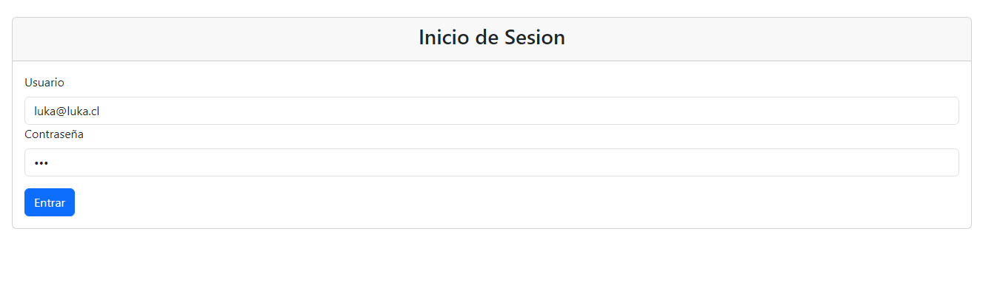
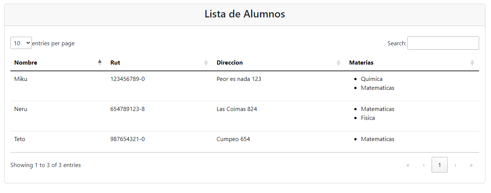

### UANDES - Gestión de Alumnos y Materias

Este proyecto es una aplicación web desarrollada en **Spring Boot** con autenticación basada en **JWT**. Permite gestionar estudiantes y materias, con funcionalidades como registro, listado, y asignación de materias a alumnos mediante la api.

##  Características

- **Autenticación JWT**.
- Gestión de **Alumnos** y **Materias**:
  - Crear nuevos alumnos y materias.
  - Asignar materias a alumnos.
  - Listar alumnos y sus materias asignadas.
- Roles:
  - **ROLE_ADMIN**: Puede acceder a todas las funcionalidades.
  - **ROLE_CLIENT**: Solo puede listar información.
- Configuración basada en **PostgreSQL** para la base de datos.
- Implementación de **Spring Security** para proteger los endpoints.

## Tecnologías Usadas

- **Java 21**
- **BACK:**
  - JAVA-JWT
  - Spring Data JPA
  - Spring Security
  - Spring DEV Tools
  - Spring Validations
- **FRONT:**
  - Thymeleaf
  - Spring DEV Tools
  - Spring WEB
  - Spring Validations
- **PostgreSQL**
- **Lombok**
- **Maven**

## Configuración del Proyecto

### Configuración de la Base de Datos
Asegúrate de tener PostgreSQL instalado y configurado. Crea una base de datos llamada `db_uandes`.

### Configura el Archivo `application.properties`
Puedes modificar las propiedades de configuración en `src/main/resources/application.properties`:

```properties
spring.application.name=UANDES
server.port=8020

spring.datasource.url=jdbc:postgresql://localhost:5432/db_uandes
spring.datasource.username=postgres
spring.datasource.password=tu_password

spring.jpa.hibernate.ddl-auto=update
spring.jpa.show-sql=true
spring.jpa.properties.hibernate.dialect=org.hibernate.dialect.PostgreSQLDialect
```

## Endpoints
### Autenticacion
  - **POST** /auth/signup: Creacion de Usuarios.
  - **POST** /auth/signin: Inicio de sesion y obtencion del JWT Token
### Alumnos
  - **GET** /api/alumnos/listar: Listar todos los alumnos.
  - **POST** /api/alumnos/guardar: Crear un nuevo alumno (requiere ROLE_ADMIN).
### Materias
  - **POST** /api/materias/guardar: Crear una nueva materia (requiere ROLE_ADMIN).

## Ejemplos

### Creacion de Usuario:

---
### Login de Usuario:

---
### Login de Usuario Front:

---
### Lista de alumnos:

---
### Lista de alumnos Front:

---
### Creacion de Materia:

---
### Creacion de Alumnos:

---
### Lista de alumnos Front New:

